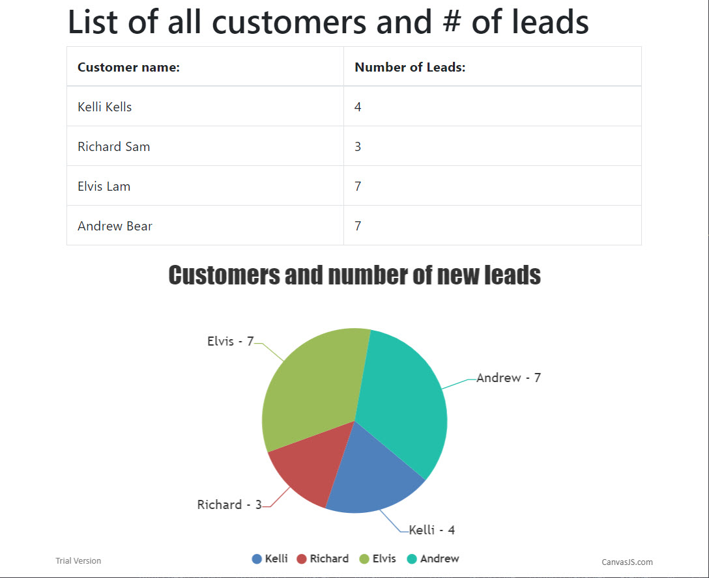

# CLIENT LIST

------------------------------------------------------------

## App's Purpose:
- Apply python flask and data to dynamically build tables and charts 

============================================================

## Technologies Utilized:
- Python
- Flask
- MySQL
- Javascript
- jQuery

=============================================================

## Developer Techniques:
- Implemented jsonify to change data from a string to an 
  object in order to access it on the index.html

=============================================================

 ### Screenshots of the app's functions:

--------------------------------------------------------------

--------------------------------------------------------------

--------------------------------------------------------------

--------------------------------------------------------------

--------------------------------------------------------------

--------------------------------------------------------------

--------------------------------------------------------------

